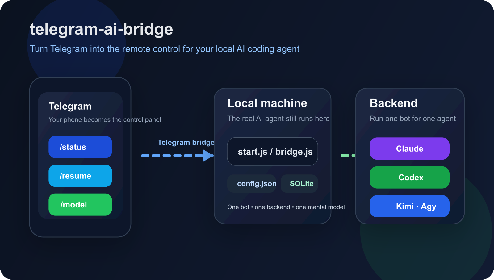
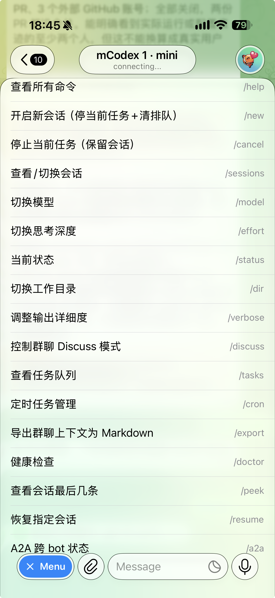

# telegram-ai-bridge：把手机变成本机 AI 的遥控器

> 状态：v5.1.1，持续维护中；我的 Mac mini 上常年跑着 8 个实例，Claude Code 三个、Codex 两个、Kimi 两个、Antigravity 一个，全部通过 Telegram 指挥。开源，MIT 协议。
> 入口：[GitHub 仓库](https://github.com/AliceLJY/telegram-ai-bridge) · [中文说明](https://github.com/AliceLJY/telegram-ai-bridge/blob/main/README_CN.md) · [A2A-TG 协议规格](https://github.com/AliceLJY/telegram-ai-bridge/blob/main/docs/a2a-tg-v1.md)

## 它解决什么

Claude Code、Codex 这些 AI 编程工具都住在终端里，而我不喜欢终端。根源很具体：终端不支持用鼠标点一下把光标挪过去，一段长话里改个错字得按方向键一格一格挪，我受不了。与其逼自己适应命令行，不如把这些工具接到我顺手的地方。Telegram 的输入框天然支持鼠标定位、自由编辑、长文本，还在手机上。

所以这个桥做的事就一句话：你在 Telegram 里发消息，真正干活的 AI 仍然在你自己的电脑上跑，结果回到聊天窗口。截图、文件、长代码会自动回传成附件，不用再问「你存哪了」。后来它长出了更多用法：几个 Claude Code 放进一个群，各自只在被点名时说话，但能读到彼此的上下文；Claude 和 Codex 在群里互相接话讨论；还有一份让异构 agent 在群聊里安全互聊的协议。

## 它长什么样

## 起点

第一次提交是 2026 年 3 月 3 日，和 RecallNest 同一天。当时它只是一个 bot 对一个 Claude Code 的遥控器。到 v5.1.1 一共 228 次提交、9 个版本号，跨了半年。

演化的几步都是用出来的。一个 bot 不够用，就有了多实例部署和 `/new`、`/resume`、`/peek` 这套会话生命周期；几个 bot 在群里互相打扰，就有了「只在被点名时开口」的 War Room 模式和 SQLite 或 Redis 的共享上下文；想让 Claude 和 Codex 真的互相接话又怕它们无限循环，就有了 A2A-TG 协议：一个受 A2A 启发的群聊信封，带代际计数封顶和按群隔离的幂等，五层防环。它和 Google 提出的官方 A2A 协议不兼容，也没有关系，README 第一段就声明了这一点。

## 几个关键取舍

- **前端迁就人，不是人迁就工具。** 桥的价值不在「多一个接入渠道」，在于编辑体验比终端好。评估任何 bridge 类工具，我先问这一条。
- **一个 bot 对应一个后端、一个心智模型。** 不做一个万能 bot 切来切去，而是 Claude、Codex、Kimi、Antigravity 各起各的实例，名字里就写着谁是谁。
- **群里默认沉默。** 多 bot 群里每个 bot 只在被点名或被回复时才必须回答，其余时候各自判断有没有值得补充的，没有就闭嘴。这条是为了让群聊不变成噪音源。
- **把「不保护什么」写在 README 里。** 数据不全留在本地：Telegram 的流量经过 Telegram，各家 AI 后端按各自的服务条款收到提示词和上下文；owner 门控只管谁能触发，不管回复内容；群聊里 bot 的每句话都写进共享存储，所以别把 bot 拉进不受自己控制的群。这些都写在安全模型一节，不藏。
- **对着官方方案说清自己站在哪。** Anthropic 后来出了 Remote Control 和 Channels，OpenClaw 是更宽的多渠道网关。这个项目的位置是自托管、Telegram 优先、多 bot 共享上下文、带自己的防环协议。README 里写明这是定位，不是宣称每个功能都有对应物。

## 怎么做出来的

这个项目通过 AI 协作完成：Claude 负责设计和验收，Codex 负责实现，我定义需求、拍板取舍、每天在手机上真用。可靠性那些细节都是全天候使用逼出来的：发送失败指数退避重试、自动识别 Telegram 的限流、800 毫秒内的消息合并、退出时 25 秒的排空窗口、流式预览里把连续五次工具调用折叠成一行。

## 踩过的坑

- **Kimi 的单轮超时会掐死长任务，而且下一轮必失忆。** 同一件事的两面：任务被杀，就拿不到会话号。9 月初把两个 Kimi 实例的超时从 30 分钟放到 65 分钟。
- **消息「好像没递到」，其实被吸收了。** 你在它跑到一半时发的消息会被正在执行的会话中途吸收，看起来像丢了；重发无效的那种才是真卡死。这两种要分开判。
- **撞到限额时切模型没用。** `/model` 对续接中的会话不生效，得先 `/new` 再切。
- **两个进程轮询同一个 bot token 会互相打架。** 后来加了自动检测和退避。

## 现在的边界

- 它跑的是完整权限的 Claude Code 和 Codex，继承你本机装的一切 MCP、hook、skill，装了不可信的东西 bot 也一起承担风险。
- 免审批模式下 bot 会直接执行命令和写文件，只适合自己一个人用的机器。
- 微信版 wechat-ai-bridge 做过，同一套思路，我现在不用了。姊妹仓 tg-bridge-channel 走的是 Claude Agent View 的后台会话路线。

## 入口

- 代码与文档：[github.com/AliceLJY/telegram-ai-bridge](https://github.com/AliceLJY/telegram-ai-bridge)
- 协议：[A2A-TG v1 规格](https://github.com/AliceLJY/telegram-ai-bridge/blob/main/docs/a2a-tg-v1_CN.md)
- 作者：小试AI，公众号「我的AI小木屋」

本页截至 v5.1.1，2026 年 9 月 8 日整理。
